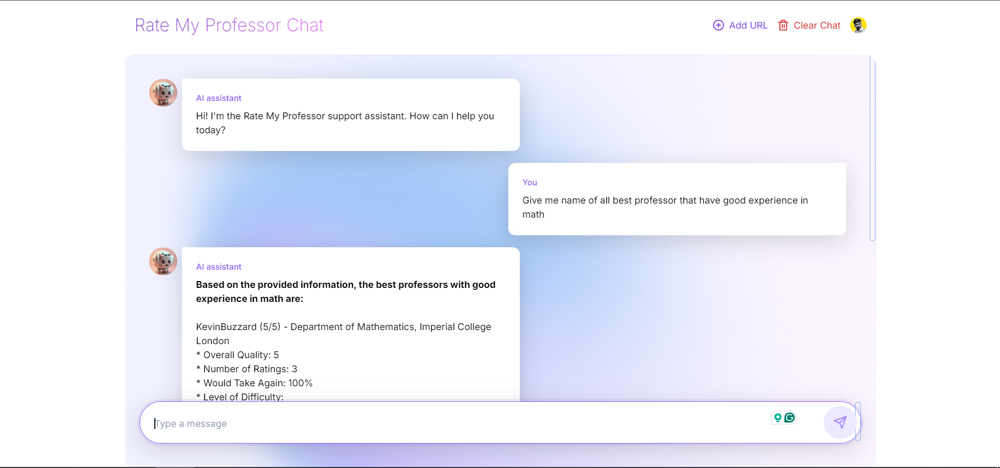

# Profeval: AI-Powered Professor Evaluation Chatbot

Welcome to **Profeval**, a cutting-edge AI chatbot designed to simplify your search for the perfect professor! With Profeval, you can access detailed evaluations, ratings, and reviews of professors, all powered by advanced AI technology.



## 📺 Watch the Demo

See Profeval in action on YouTube: [YouTube Demo](https://lnkd.in/dtYQPaCz)

## 🔧 Key Features

- **AI-Driven Professor Evaluations**: Get accurate and comprehensive reviews of professors based on real student feedback from Rate My Professor, powered by the Groq LLaMA 8b model.
- **Advanced Search**: Utilize powerful search capabilities to find professors by name, department, or school.
- **Dynamic UI**: Enjoy a sleek and intuitive interface built with Tailwind CSS and shadcnUI, making it easy to navigate through the data.
- **URL Scraping**: Gather detailed data on your specified professor using Scraper API and Cheerio, ensuring up-to-date information.
- **Vector Database**: Efficiently search and retrieve data using Pinecone and Hugging Face Inference API, making Profeval fast and reliable.
- **Secure Authentication**: Protect your data with Clerk, providing a seamless and secure sign-in experience.

## 💻 Tech Stack

- **Frontend**: Next.js, TypeScript, Tailwind CSS, ShadCN UI
- **AI**: Groq LLaMA 8b Model
- **URL Scraping**: Scraper API, Cheerio
- **Vector Database**: Pinecone, Hugging Face Inference API
- **Authentication**: Clerk

## 🛠 Installation & Setup

To run Profeval locally, follow these steps:

1. **Clone the repository**:

    ```bash
    git clone https://github.com/ahkamboh/Rate-My-Professor-Chatbot.git
    git clone https://github.com/mkhan429419/Rate-My-Professor-Chatbot.git
    cd Rate-My-Professor-Chatbot
    ```

2. **Install dependencies**:

    ```bash
    npm install
    ```

3. **Set up environment variables**:

   Create a `.env` file in the root directory and add your keys:

    ```plaintext
    NEXT_PUBLIC_CLERK_FRONTEND_API=<Your Clerk Frontend API>
    CLERK_API_KEY=<Your Clerk API Key>
    PINECONE_API_KEY=<Your Pinecone API Key>
    SCRAPER_API_KEY=<Your Scraper API Key>
    ```

4. **Run the development server**:

    ```bash
    npm run dev
    ```

    Open [http://localhost:3000](http://localhost:3000)  to view it in the browser.

## 🙏 Acknowledgments

A special thank you to the entire Headstarter team, **Yasin Ehsan** 🚀 and **Faizan Ahmed**, for their continued support and for fostering an environment where innovation thrives!

## 🌟 Contributors

- [Maheen Akhtar Khan](https://github.com/mkhan429419)
- [Aneeza Shakeel](https://github.com/aneezahere)
- [Syeda Fatima tu zahra](https://www.linkedin.com/in/syeda-fatima-tu-zahra-940784250/e)

## 📄 License

This project is licensed under the MIT License - see the [LICENSE.md](LICENSE.md) file for details.

## 💬 Let's Connect

Interested in learning more? Let's connect! Feel free to drop your questions in the comments below or reach out directly.

## 🔗 Links

- [Live Demo](https://lnkd.in/d9W4DxiG)
- [GitHub Repository](https://lnkd.in/dZvp9Unm)
- [YouTube Demo](https://lnkd.in/dtYQPaCz)

## 📢 Follow us on Linkedin
- [Maheen Akht
ar Khan](https://www.linkedin.com/in/maheen-akhtar-khan-377082267/)
- [Aneeza Shakeel](https://github.com/aneezahere)
- [Syeda Fatima tu zahra](https://www.linkedin.com/in/syeda-fatima-tu-zahra-940784250/)
- [Ali Hamza Kamboh](https://www.linkedin.com/in/ahkamboh)


